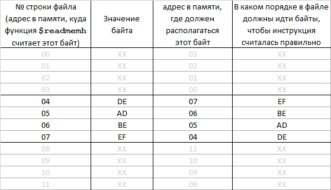

# Лабораторная работа 6 "Тракт данных"

Микроархитектуру можно разделить на две части: тракт данных и устройство управления. По тракту данных перемещаются данные (из памяти инструкций, регистрового файла, АЛУ, памяти данных, мультиплексоров), а устройство управления (основной дешифратор команд) получает текущую инструкцию из тракта и в ответ говорит ему как именно выполнить эту инструкцию, то есть управляет тем, как эти данные будут через тракт данных проходить.

## Цель

Описать на языке **SystemVerilog** процессор с архитектурой **RISC-V**, реализовав его тракт данных, использую ранее разработанные блоки, и подключив к нему устройство управления. В рамках этого трека лабораторных работ требуется реализовать только поддержку обработки слов (то есть БЕЗ инструкций, связанных с байтами и полусловами: `lh`, `lhu`, `lb`, `lbu`, `sh`, `sb`).

## Ход работы

1. Изучить микроархитектурную реализацию однотактного процессора RISC-V (без поддержки команд загрузки/сохранения байт/полуслов)
2. Реализовать тракт данных с подключенным к нему устройством управления([#задание](#задание))
3. Подготовить программу по индивидуальному заданию и загрузить ее в память инструкций
4. Сравнить результат работы процессора на модели в **Vivado** и в симуляторе программы ассемблера

## Микроархитектура RISC-V

### riscv_core

Рассмотрим микроархитектуру процессорного ядра `riscv_core`. Данный модуль обладает следующим прототипом и микроархитектурой:

```SystemVerilog
module riscv_core (

  input  logic        clk_i,
  input  logic        rst_i,

  input  logic        stall_i,
  input  logic [31:0] instr_i,
  input  logic [31:0] mem_rd_i,

  output logic [31:0] instr_addr_o,
  output logic [31:0] mem_addr_o,
  output logic [ 2:0] mem_size_o,
  output logic        mem_req_o,
  output logic        mem_we_o,
  output logic [31:0] mem_wd_o
);

endmodule
```


_Рисунок 1. Микроархитектура ядра процессора RISC-V._

В отличие от реализованного ранее процессора с архитектурой CYBERcobra, в данном модуле отсутствует память (она подключается извне, а значит у этого модуля должны быть сигналы интерфейса памяти).

Кроме того, в данной микроархитектуре используется пять различных видов констант (соответствующих определенным типам инструкций).

Константы `I`,`U`,`S` используются для вычисления адресов и значений. Поэтому все эти константы должны быть подключены к АЛУ. А значит теперь, для выбора значения для операндов требуются мультиплексоры, определяющие что именно будет подаваться на АЛУ.

Обратите внимание на константу `imm_U`. В отличие от всех остальных констант, она не знакорасширяется, вместо этого к ней приклеивается справа 12 нулевых бит.

Программный счетчик (`PC`) теперь также изменяется более сложным образом. Поскольку появился еще один вид безусловного перехода (`jalr`), программный счетчик может не просто увеличиться на значение константы из инструкции, но и получить совершенно новое значение в виде суммы константы и значения из регистрового файла (см. на самый левый мультиплексор схемы). Обратите внимание, что младший бит этой суммы должен быть обнулен — таково требование спецификации.

Поскольку обращение во внешнюю память требует времени, необходимо останавливать программный счетчик, чтобы до конца обращения в память не начались исполняться последующие инструкции. Для этого у программного счетчика появился управляющий сигнал `stall_i`. Программный счетчик может меняться только когда этот сигнал равен нулю (иными словами, инверсия этого сигнала является сигналом `enable` для регистра `PC`).

### riscv_unit

После реализации процессорного ядра, к нему необходимо подключить память. Это происходит в модуле `riscv_unit`.

```SystemVerilog
module riscv_unit(
  input  logic        clk_i,
  input  logic        rst_i
);

endmodule
```


_Рисунок 2. Микроархитектура процессора._

Обратите внимание на регистр `stall`. Этот регистр и будет управлять разрешением на запись в программный счетчик `PC`. Поскольку мы используем блочную память, расположенную прямо в ПЛИС, доступ к ней осуществляется за 1 такт, а значит, что при обращении в память, нам необходимо "отключить" программный счетчик ровно на 1 такт. Если бы использовалась действительно "внешняя" память (например чип DDR3), то вместо этого регистра появилась бы другая логика, выставляющая на вход ядра `stall_i` единицу пока идет обращение в память.

## Задание

Реализовать ядро процессора `riscv_core` архитектуры RISC-V по предложенной микроархитектуре. Подключить к нему память инструкций и память данных в модуле `riscv_unit`. Проверить работу процессора с помощью программы, написанной на ассемблере RISC-V по индивидуальному заданию, которое использовалось для написания программы для процессора архитектуры CYBERcobra.

<!--
### Как инициализировать память инструкций новой программой

Поскольку теперь ваш процессор почти полностью соответствует спецификации RISC-V, вы можете пользоваться существующими компиляторами, а значит, теперь для написании программы можно воспользоваться языком ассемблера RISC-V (помните, что пока вы не поддерживаете инструкции `lh`, `lhu`, `lb`, `lbu`, `sh`, `sb`).

Обычно ассемблеры выдают код собранной программы в виде шестнадцатеричных строк. При записи программы в файл инициализации, вы должны убрать префикс `0x`, если таковой имеется, поскольку системная функция инициализации памяти `$readmemh` и так уже настроена читать в шестнадцатеричном формате.

Кроме того, поскольку каждая ячейка памяти занимает 8 бит, необходимо разбить строки инструкции на отдельные байты. Однако после того как вы это сделаете, нарушится порядок байт. Микроархитектурная реализация процессора построена с использованием порядка байт под названием **Little endian**. Это означает, что старший байт инструкции должен располагаться по старшему адресу, младший байт инструкции — по младшему (привязка к **Little endian** вытекает из двух модулей: памяти инструкций и декодера инструкций). Проблема заключается в том, что функция `$readmemh` загружает байты, начиная с младших адресов.

Предположим, мы описываем содержимое памяти инструкций и у нас есть очередная инструкция `0xDEADBEEF` (`jal`). Если она должна быть размещена в памяти, начиная с адреса `4`, то байт `EF` должен находиться по 4-ому адресу, байт `BE` — по пятому и т.п. Допустим, мы разделили байты инструкций символами переноса строк (и что строки в файле нумеруются с нуля). Тогда соответствие между строкой, байтом инструкции и адресом в памяти, где этот байт должен быть расположен будет следующим:



Если после разделения инструкции переносами, мы не изменим порядок байт в файле, при считывании файла САПР будет инициализировать память наоборот: ячейка с младшим адресом будет проинициализирована строкой с младшим номером. Если оставить все как есть, процессор считает из памяти инструкцию `0xEFBEADDE` (вместо jal получаем нелегальную инструкцию, т.к. младшие 2 бита не равны 1).

Чтобы данные легли в память в нужном порядке, **необходимо изменить порядок следования байт в текстовом файле**. Современные текстовые редакторы поддерживают режим множественных курсоров, что позволяет довольно быстро выполнить данную процедуру.

<details>
<summary> Пример такого редактирования </summary>
В VSCode дополнительные курсоры создаются либо через `alt+ЛКМ`, либо через `alt+ctrl+UP`, `alt+ctrl+DOWN`. Vivado так же поддерживает множественные курсоры (проведя мышью с зажатой ЛКМ вдоль нужных строк при зажатой клавише `Ctrl`).


</details>
-->
Напишем простую программу, которая использует все типы инструкций для проверки нашего процессора. Сначала напишем программу на ассемблере:

```assembly
00:  addi  x1,  x0, 0x75С
04:  addi  x2,  x0, 0x8A7
08:  add   x3,  x1, x2
0C:  and   x4,  x1, x2
10:  sub   x5,  x4, x3
14:  mul   x6,  x3, x4    // неподдерживаемая инструкция
18:  jal   x15, 0x00050   // прыжок на адрес 0x68
1C:  jalr  x15, 0x0(x6)
20:  slli  x7,  x5, 31
24:  srai  x8,  x7, 1
28:  srli  x9,  x8, 29
2C:  lui   x10, 0xfadec
30:  addi  x10, x10,-1346
34:  sw    x10, 0x0(x4)
38:  sh    x10, 0x6(x4)
3C:  sb    x10, 0xb(x4)
40:  lw    x11, 0x0(x4)
44:  lh    x12, 0x0(x4)
48:  lb    x13, 0x0(x4)
4С:  lhu   x14, 0x0(x4)
50:  lbu   x15, 0x0(x4)
54:  auipc x16, 0x00004
58:  bne   x3,  x4, 0x08  // перескок через
5С:                       // нелегальную нулевую инструкцию
60:  jal   x17, 0x00004
64:  jalr  x14, 0x0(x17)
68:  jalr  x18, 0x4(x15)
```

Теперь в соответствии с кодировкой инструкций переведем программу в машинные коды:

```text
00:  011101011100  00000 000 00001 0010011
04:  100010100111  00000 000 00010 0010011
08:  0000000 00010 00001 000 00011 0110011
0C:  0000000 00010 00001 111 00100 0110011
10:  0100000 00011 00100 000 00101 0110011
14:  0000001 00100 00011 000 00110 0110011
18:  00000101000000000000    01111 1101111
1C:  000000000000  00110 000 01111 1100111
20:  0000000 11111 00101 001 00111 0010011
24:  0100000 00001 00111 101 01000 0010011
28:  0000000 11101 01000 101 01001 0010011
2C:  11011110101011011100    01010 0110111
30:  111010101111  01010 000 01010 0010011
34:  0000000 01010 00100 010 00000 0100011
38:  0000000 01010 00100 001 00110 0100011
3C:  0000000 01010 00100 000 01011 0100011
40:  000000000000  00100 010 01011 0000011
44:  000000000000  00100 001 01100 0000011
48:  000000000000  00100 000 01101 0000011
4C:  000000000000  00100 101 01110 0000011
50:  000000000000  00100 100 11101 0000011
54:  00000000000000000100    10000 0010111
58:  0000000 00011 00100 001 01000 1100011
5C:  00000000  00000000 00000000  00000000
60:  00000000010000000000    10001 1101111
64:  000000000000  10001 000 01110 1100111
68:  000000000100  01111 000 10010 1100111
```

Данная программа, представленная в шестнадцатеричном формате находится в файле [program.mem](program.mem).

## Порядок выполнения задания

1. Внимательно ознакомьтесь микроархитектурной реализацией. В случае возникновения вопросов, проконсультируйтесь с преподавателем.
2. Реализуйте модуль `riscv_core`. Для этого:
   1. В `Design Sources` проекта с предыдущих лаб, создайте `SystemSystemVerilog`-файл `riscv_core.sv`.
   2. Опишите в нем модуль процессор `riscv_core` с таким же именем и портами, как указано в [задании](#задание).
      1. Процесс реализации модуля очень похож на процесс описания модуля cybercobra, однако теперь появляется:
         1. декодер
         2. дополнительные мультиплексоры и знакорасширители.
   3. Создайте в проекте новый `SystemSystemVerilog`-файл `riscv_unit.sv` и опишите в нем модуль `riscv_unit`, объединяющий ядро процессора (`riscv_core`) с памятями инструкция и данных.
      1. **При создании объекта модуля `riscv_core` в модуле `riscv_unit` вы должны использовать имя сущности `core` (т.е. создать объект в виде: `riscv_core core(...`)**
3. После описания модуля, его необходимо проверить с помощью тестового окружения.
   1. Тестовое окружение находится [`здесь`](tb_riscv_unit.sv).
   2. Программа, которой необходимо проинициализировать память инструкций находится [`здесь`](program.mem).
   3. Для запуска симуляции воспользуйтесь [`этой инструкцией`](../../Vivado%20Basics/Run%20Simulation.md).
   4. Перед запуском симуляции убедитесь, что выбран правильный модуль верхнего уровня.
   5. **Во время симуляции убедитесь, что в логе есть сообщение о завершении теста!**
   6. Вполне возможно, что после первого запуска вы столкнетесь с сообщениями о множестве ошибок. Вам необходимо [исследовать](../../Vivado%20Basics/Debug%20manual.md) эти ошибки на временной диаграмме и исправить их в вашем модуле.
4. Добавьте в проект модуль верхнего уровня ([nexys_riscv_unit.sv](board%20files/nexys_riscv_unit.sv)), соединяющий основной ваш процессор с периферией в ПЛИС. Описание работы модуля находится [здесь](board%20files).
5. Подключите к проекту файл ограничений ([nexys_a7_100t.xdc](board%20files/nexys_a7_100t.xdc)), если тот еще не был подключен, либо замените его содержимое данными из файла к этой лабораторной работе.
6. Проверьте работу процессора в ПЛИС.

---

<details>
  <summary>Прочти меня, когда выполнишь.</summary>
  Поздравляю, ты сделал(а) свой первый взрослый процессор! Теперь ты можешь говорить:

 >Я способен(на) на всё! Я сам(а) полностью, с нуля, сделал(а) процессор с архитектурой RISC-V! Что? Не знаешь, что такое архитектура? Пф, щегол! Подрастешь – узнаешь

</details>
