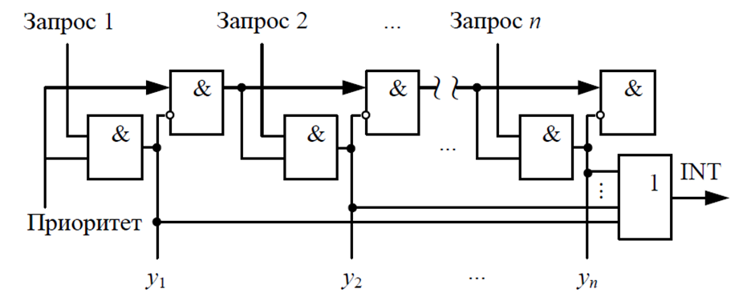

# Лабораторная работа 12 "Увеличение количества источников прерываний с помощью дейзи-цепочки"

В базовом варианте лабораторных работ вам было предложено реализовать процессорную систему с одним источником прерываний. Этого достаточно для выполнения лабораторных работ, однако, в случае если вы захотите увеличить количество периферийных устройств, поддержка только одного источника прерываний станет источником проблем. В данной лабораторной работе вы реализуете блок приоритетных прерываний и интегрируете его в контроллер прерываний, увеличив число источников прерываний до 16.

## Цель

1. Разработать блок приоритетных прерываний (БПП), построенный по схеме дейзи-цепочки.
2. Интегрировать БПП в контроллер прерываний.

## Теория

В случае, если в процессорной системе более одного источника прерываний, необходимо разобраться с тем, что делать, если произойдет коллизия (наложения) нескольких источников прерываний. Необходимо организовать приоритет прерываний. Со схемотехнической точки зрения, проще всего реализовать схему со статическим приоритетом. Одной из таких схем является дейзи-цепочка. Пример такой схемы вы можете увидеть на _рис. 1_.

_Рисунок 1. Структурная схема daisy-цепочки._

Дейзи-цепочка состоит из двух массивов элементов И. Первый массив (верхний ряд элементов) формирует многоразрядный сигнал (назовем его для определенности `ready`, на _рис. 1_ он обозначен как "_Приоритет_"), который перемножается с запросами с помощью массива элементов И нижнего ряда, формируя многоразрядный сигнал `y`. Обратите внимание на то, что результат операции И на очередном элементе нижнего массива влияет на результат И на следующем за ним элемента верхнего массива и наоборот (`readyₙ₊₁` зависит от `yₙ`, в то время как `yₙ` зависит от `readyₙ`). Как только на одном из разрядов `y` появится значение `1`, оно сразу же распространится в виде `0` по всем оставшимся последующим разрядам `ready`, обнуляя их. А обнулившись, разряды `ready` обнулят соответствующие разряды `y` (нулевые разряды `ready` запрещают генерацию прерывания для соответствующих разрядов `y`).

Для описания верхнего ряда элементов И на языке SystemVerilog будет удобно воспользоваться конструкцией `generate for`, о которой рассказывалось в [ЛР 1 "Сумматор"](../01.%20Adder#Задание) (необходимо сделать непрерывное присваивание `readyₙ & !yₙ` для `n+1`-ого бита `ready`).

Нижний массив элементов И можно описать через непрерывное присваивание побитового И между `ready` и сигналом запросов на прерывание.

## Практика

Рассмотрим реализацию нашего контроллера прерываний:

_Рисунок 2. Структурная схема блока приоритетных прерываний._

Помимо портов `clk_i` и `rst_i`, модуль `daisy_chain` будет иметь 3 входа и три выхода:

- `masked_irq_i` — 16-разрядный вход маскированного запроса на прерывания (т.е. источник прерывание уже прошел маскирование сигналом CS-регистра `mie`).
- `irq_ret_i` — сигнал о возврате управления основному потоку инструкций (выход из обработчика прерываний)
- `ready_i` — сигнал о готовности процессора к перехвату (т.е. прямо сейчас процессор не находится в обработчике перехвата). Это нулевой бит сигнала `ready` в дейзи-цепочке. Пока `ready_i` равен нулю, дейзи-цепочка не будет генерировать сигналы прерываний.
- `irq_o` — сигнал о начале обработки прерываний
- `irq_cause_o` — причина прерывания.
- `irq_ret_o` — сигнал о завершении обработки запроса на прерывания. Будет соответствовать `cause_o` в момент появления сигнала `mret_i`.

Внутренний сигнал `cause` является сигналом `y` с _рис. 1_. Как пояснялось выше, этот сигнал может содержать только одну единицу, она будет соответствовать прошедшему запросу на прерывание. А значит этот результат можно использовать в качестве сигнала для идентификации причины прерывания. При этом, свертка по ИЛИ этого сигнала даст итоговый запрос на прерывание.

Однако, как упоминалось в ЛР10, спецификация RISC-V накладывает определенные требования на кодирование кода `mcause` для причины прерывания. В частности, необходимо выставить старший бит в единицу, а значение на оставшихся битах должно быть больше 16. Схемотехнически это проще реализовать выполнив склейку `{12'h800, cause, 4'b0000}` — в этом случае старший разряд будет равен единице, и если хоть один разряд `cause` будет равен единице (а именно это и является критерием появления прерывания), младшие 31 бит `mcause` будут старше 16.

Регистр на _рис. 2_ хранит значение внутреннего сигнала `cause`, чтобы по завершению прерывания выставить единицу на соответствующем разряде сигнала `irq_ret_o`, который сообщит устройству, чье прерывание обрабатывалось ранее, что его обработка завершена.

## Задание

- Реализовать модуль `daisy_chain`.
- Интегрировать `daisy_chain` в модуль `irq_controller` по схеме, представленной на _рис. 3_.
- Отразить изменения в прототипе сигнала `irq_controller` в модулях `riscv_core` и `riscv_unit`.

_Рисунок 3. Структурная схема блока приоритетных прерываний._

Разрядность сигналов `irq_req_i`, `mie_i`, `irq_ret_o` изменилась. Теперь это 16-разрядные сигналы. Сигнал, который ранее шел на выход к `irq_ret_o` теперь идет на вход `irq_ret_i` модуля `daisy_chain`. Формирование кода причины прерывания `irq_cause_o` перенесено в модуль `daisy_chain`.

## Порядок выполнения работы

1. Опишите модуль `daisy_chain`.
   1. При формировании верхнего массива элементов И с _рис. 2_, вам необходимо воспользоваться сформировать 16 непрерывных присваиваний через блок `generate for`.
   2. Формирование нижнего массива элементов И можно сделать с помощью одного непрерывного присваивания посредством операции побитовое И.
   3. Проверьте модуль `daisy_chain` с помощью модуля [`tb_daisy_chain`](tb_daisy_chain.sv).
2. Интегрируйте модуль `daisy_chain` в модуль `irq_controller` по схеме, представленной на _рис. 3_.
   1. Не забудьте обновить разрядность сигналов `irq_req_i`, `mie_i`, `irq_ret_o`.
   2. Также не забудьте обновить разрядность сигналов `irq_req_i`, `irq_ret_o` в `riscv_core` и `riscv_unit`, также использовать младшие 16 бит сигнала `mie` вместо одного при подключении модуля `irq_controller`.
